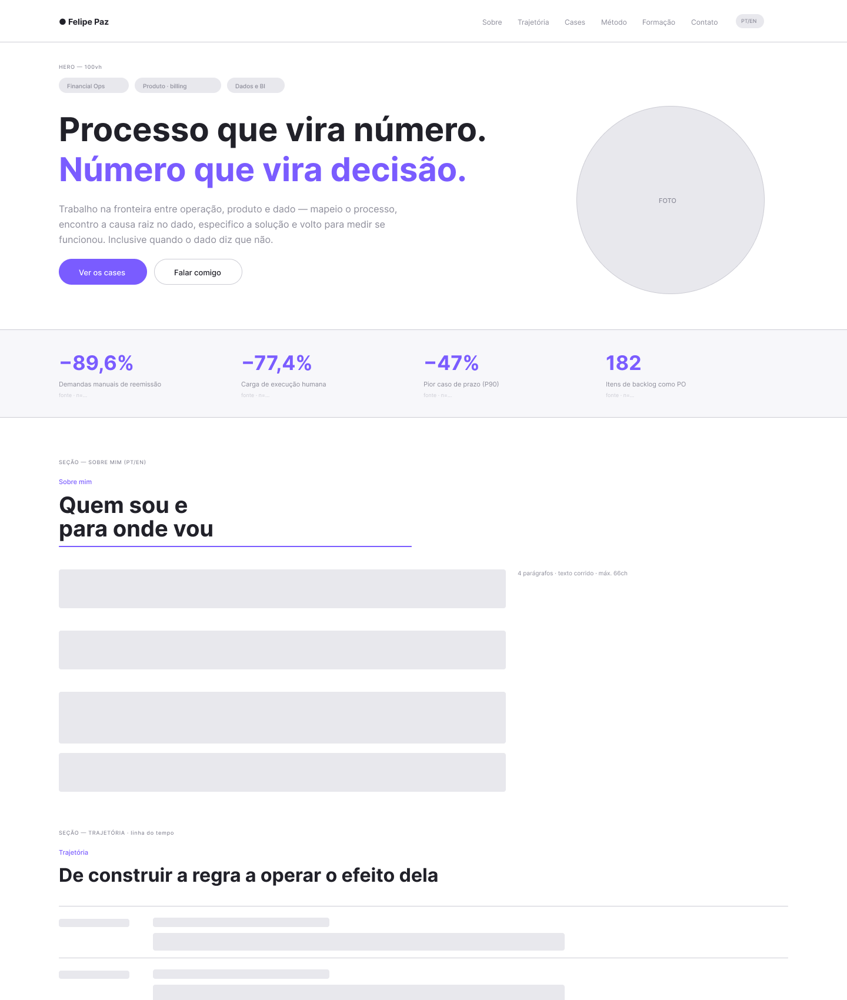
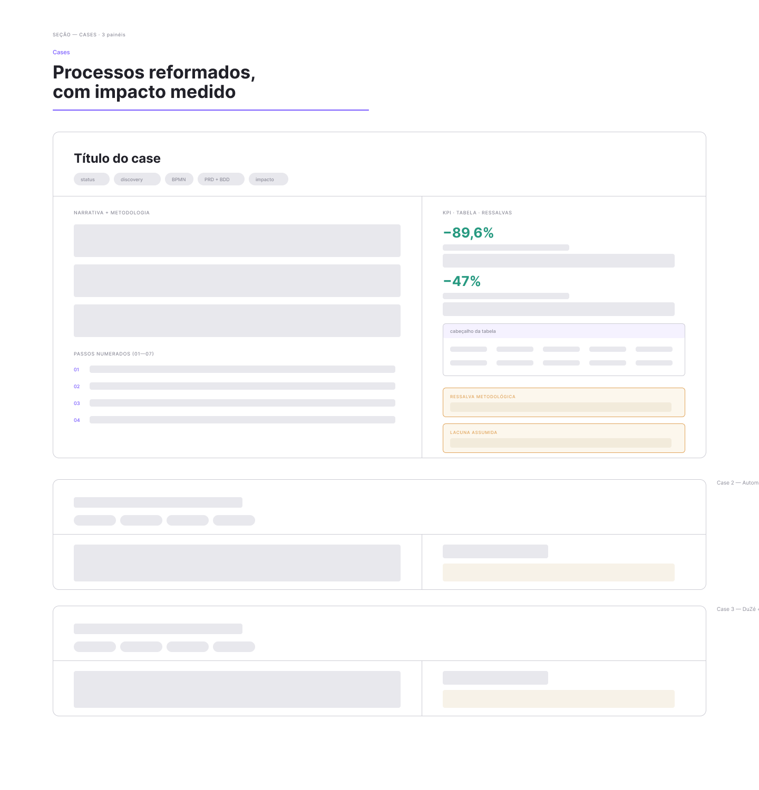
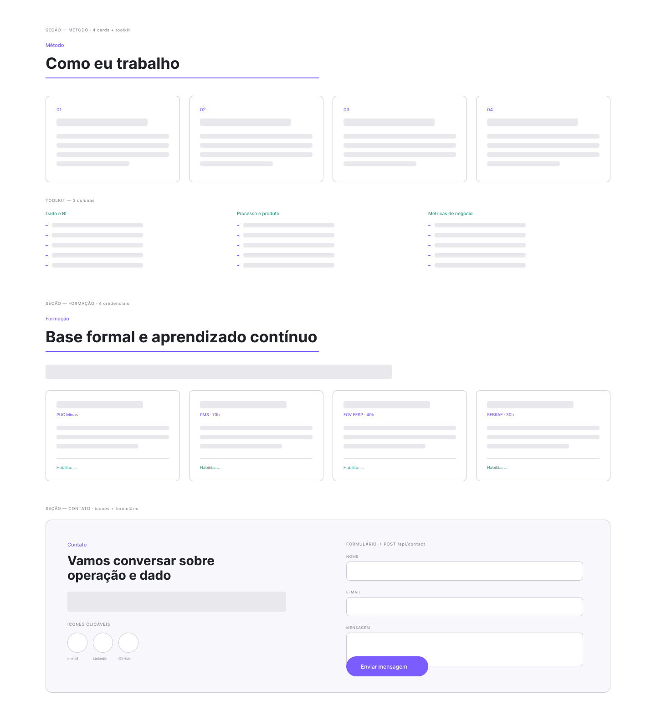
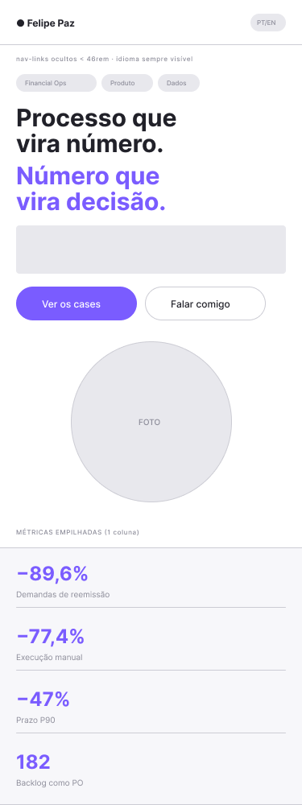
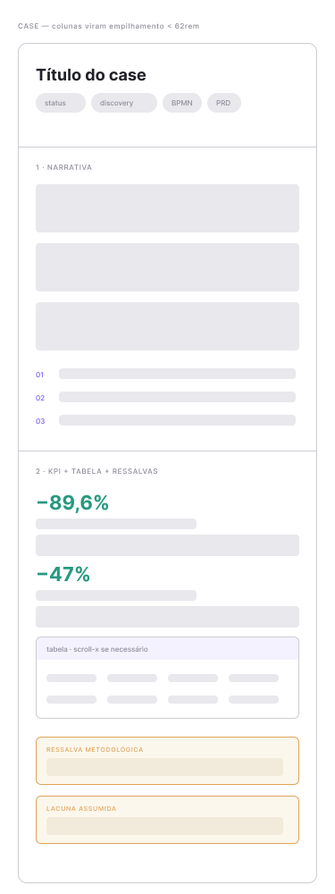
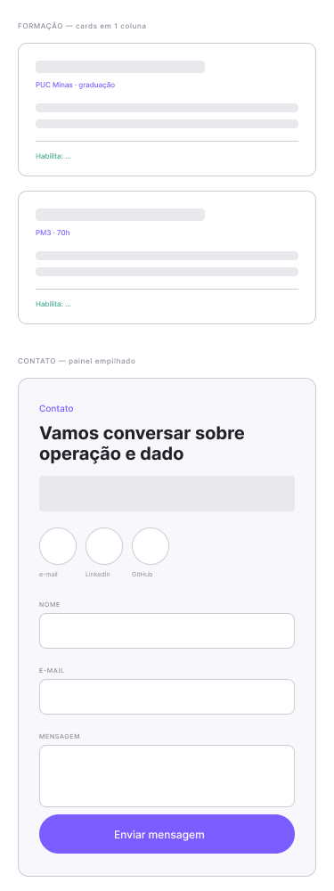

# Portfólio Profissional — Felipe Paz Carvalho Batista

Website de portfólio profissional bilíngue (PT/EN), desenvolvido para a disciplina
**Projeto de Software** — Laboratório 1, Engenharia de Software, PUC Minas (2º semestre/2026).

🔗 **Site publicado:** _(a ser preenchido na Sprint 3)_

---

## Sobre o projeto

O site apresenta minha trajetória profissional na interseção entre **operações, produto e dado**,
organizando cases com impacto medido, metodologia declarada e ressalvas registradas.

A proposta editorial da página é uma decisão de design consciente: em vez de listar tecnologias
e adjetivos, cada case apresenta o problema, o que foi feito, o número que mudou e — de forma
deliberadamente visível — a ressalva metodológica de cada leitura. Onde não há impacto medido,
isso está dito explicitamente.

### Seções

| Seção | Conteúdo |
|---|---|
| **Sobre mim** | Apresentação, formação, área de atuação e objetivos — em português e inglês |
| **Trajetória** | Linha do tempo de experiências, do mais antigo ao mais recente |
| **Cases** | Projetos com contexto, metodologia, resultado medido e ressalvas |
| **Método** | Princípios de trabalho e stack técnica |
| **Formação** | Graduação e formação complementar, com o que cada uma habilita |
| **Contato** | Ícones clicáveis (e-mail, LinkedIn, GitHub) e formulário com envio por e-mail |

---

## Tecnologias utilizadas

### Front-end
| Tecnologia | Uso |
|---|---|
| **HTML5** | Estrutura semântica das seções |
| **CSS3** | Design system em custom properties, Grid e Flexbox, responsividade |
| **JavaScript (ES6+)** | i18n, animações, formulário, Canvas |
| **Canvas API** | Campo de estrelas animado com parallax no scroll |
| **Intersection Observer API** | Revelação de seções e contadores animados no scroll |
| **Google Fonts** | Space Grotesk, Sora e JetBrains Mono |

Sem framework de front-end e sem etapa de build — decisão tomada para manter o projeto
editável diretamente e o deploy simples.

### Back-end
| Tecnologia | Uso |
|---|---|
| **Node.js** (≥18) | Runtime |
| **Express** | Servidor HTTP e rotas |
| **Nodemailer** | Envio das mensagens do formulário por e-mail |
| **express-rate-limit** | Limite de 5 envios por IP a cada 15 minutos |
| **dotenv** | Variáveis de ambiente |
| **cors** | Controle de origem das requisições |
| **helmet** | Cabeçalhos de segurança (CSP, HSTS, X-Frame-Options) |

---

## Estrutura de diretórios

```
portfolio/
├── frontend/
│   ├── index.html          # Página única com todas as seções
│   ├── css/
│   │   ├── tokens.css      # Paleta, tipografia e escala — muda a página inteira
│   │   ├── base.css        # Reset, utilitários, chips, botões, fundo animado
│   │   ├── layout.css      # Nav, hero, métricas, trajetória, contato, footer
│   │   └── cases.css       # Painéis de case, KPIs, tabelas, ressalvas, formação
│   ├── js/
│   │   ├── i18n.js         # Dicionário PT/EN (192 chaves)
│   │   └── main.js         # i18n, canvas, nav, reveal, contadores, formulário
│   └── assets/
│       ├── foto-perfil.jpg
│       ├── cv/             # Currículo em PDF
│       └── projetos/       # Imagens dos projetos
├── backend/
│   ├── server.js           # API Express + envio de e-mail
│   ├── package.json
│   └── .env.example        # Modelo das variáveis de ambiente
├── docs/wireframes/        # Protótipos do Figma
├── render.yaml             # Configuração de deploy
├── .gitignore
└── README.md
```

---

## Instalação e execução local

### Pré-requisitos
- Node.js 18 ou superior
- Conta Gmail com **senha de app** (Verificação em duas etapas ativada)

### Passos

```bash
# 1. Clone o repositório
git clone https://github.com/felipepcbatista/portfolio-felipe-paz.git
cd portfolio-felipe-paz

# 2. Instale as dependências do back-end
cd backend
npm install

# 3. Configure as variáveis de ambiente
cp .env.example .env
# edite o .env e preencha EMAIL_USER e EMAIL_PASS

# 4. Inicie o servidor
npm start
```

Acesse **http://localhost:3000**. O servidor Express serve o front-end estático e expõe a API.

### Variáveis de ambiente

| Variável | Descrição | Obrigatória |
|---|---|---|
| `EMAIL_USER` | Conta Gmail que envia as mensagens | Sim |
| `EMAIL_PASS` | Senha de app do Gmail (16 caracteres) | Sim |
| `EMAIL_TO` | Destino das mensagens (padrão: `EMAIL_USER`) | Não |
| `PORT` | Porta do servidor (padrão: 3000) | Não |
| `NODE_ENV` | `production` na hospedagem — ativa o `trust proxy` | Em produção |
| `ALLOWED_ORIGIN` | Só se o front for hospedado em outro domínio | Não |

> A senha de app **não** é a senha da conta Google. Gere em
> *Conta Google → Segurança → Verificação em duas etapas → Senhas de app*.
> O arquivo `.env` está no `.gitignore` e nunca deve ser versionado.

---

## API

### `GET /api/health`
Verificação de disponibilidade do serviço.

```json
{ "status": "ok", "service": "portfolio-backend" }
```

### `POST /api/contact`
Recebe a mensagem do formulário e encaminha por e-mail.

**Corpo:**
```json
{
  "nome": "string (mín. 2 caracteres)",
  "email": "string (formato válido)",
  "mensagem": "string (mín. 10 caracteres)",
  "website": "honeypot — deve vir vazio"
}
```

**Respostas:** `200` enviado · `400` validação · `429` limite excedido · `500` falha no envio.

**Proteções implementadas:**
- Validação no cliente e no servidor
- Honeypot (campo invisível que bots preenchem)
- Rate limit de 5 envios por IP a cada 15 minutos
- CORS restrito à própria origem — a API não aceita chamadas de outros domínios
- Cabeçalhos de segurança via `helmet`, com CSP liberando apenas o Google Fonts
- `trust proxy` em produção, para o rate limit contar o IP real do visitante em vez
  do IP do proxy da hospedagem
- `replyTo` com o e-mail do visitante, evitando que o Gmail marque como spoofing

---

## Decisões de arquitetura

**Página única com navegação por âncoras.** O enunciado pede "seções acessadas por um menu de
navegação" e "links entre seções" — implementado com navegação fixa, âncoras e rolagem suave.
A escolha por single-page é deliberada: em portfólio profissional, a leitura contínua favorece
a narrativa de trajetória, e cada recarregamento de página é um ponto de abandono a mais.

**Sem framework de front-end.** O conteúdo do portfólio é atualizado com frequência, e HTML/CSS
puro mantém a edição direta, sem etapa de build entre a alteração e o resultado. O CSS é
organizado em quatro arquivos por responsabilidade, com design system em custom properties —
alterar `tokens.css` muda a identidade visual da página inteira.

**Back-end próprio em vez de serviço de formulário.** Serviços como Formspree resolveriam o
envio sem código, mas a disciplina é Projeto de Software: um servidor próprio permite validação,
rate limit e tratamento de erro sob controle da aplicação.

**Bilíngue em todo o site, não apenas no "Sobre mim".** O idioma é detectado a partir do
navegador e pode ser alternado a qualquer momento, com a preferência persistida no
`localStorage`. São 192 chaves de tradução cobrindo inclusive a narrativa completa dos cases.

---

## Responsividade

Layout fluido validado em navegador real (Chrome headless), medindo `scrollWidth` contra a
viewport em 8 larguras — sem rolagem horizontal em nenhuma delas.

| Largura | Comportamento |
|---|---|
| 320–413px | Coluna única, menu deslizante, métricas empilhadas |
| 414–767px | Coluna única com mais respiro lateral |
| 768–831px | Formação em 2 colunas, menu ainda deslizante |
| 832–991px | Navegação completa, cases ainda empilhados |
| 992px+ | Layout completo em duas colunas |

**Breakpoints e o que muda em cada um**

| Breakpoint | Efeito |
|---|---|
| `62rem` (992px) | Colunas do case (narrativa \| KPIs) empilham |
| `58rem` (928px) | Hero passa a coluna única |
| `56rem` (896px) | Painel de contato empilha texto e formulário |
| `52rem` (832px) | Navegação vira menu deslizante; chips passam a quebrar linha |
| `46rem` (736px) | Faixa de métricas em coluna única; margens e espaçamentos reduzidos |
| `23.75rem` (380px) | Marca e alternador de idioma compactam na barra |

**Técnicas aplicadas**

- Tipografia e espaçamentos fluidos com `clamp()`, sem saltos entre breakpoints
- `minmax(0, 1fr)` e `min-width: 0` em filhos de grid — sem isso o conteúdo define a largura
  mínima e a coluna estoura o contêiner
- `minmax(min(24rem, 100%), 1fr)` nos grids automáticos, evitando pedir mais largura do que
  a tela oferece
- Tabelas em contêiner com `overflow-x: auto`, preservando a leitura em telas estreitas
- Inputs com `font-size: 16px` no mobile, evitando o zoom automático do iOS ao focar
- Alvos de toque de no mínimo 44px nos controles principais
- `prefers-reduced-motion` respeitado em todas as animações, incluindo o menu

---

## Processo de desenvolvimento

| Sprint | Escopo | Status |
|---|---|---|
| **Lab01S01** | Planejamento, wireframes, protótipo e navegação | ✅ Concluída |
| **Lab01S02** | Funcionalidades principais e responsividade | 🔜 |
| **Lab01S03** | Deploy, ajustes finais e README final | 🔜 |

### Wireframes

Protótipos de média fidelidade construídos no Figma antes da implementação.
Arquivo completo: [Figma — Wireframes Lab01S01](https://www.figma.com/design/4CilL4rHu38ffSLdQlTYVL)

#### Desktop — 1440px

**Hero, faixa de métricas, Sobre mim e início da Trajetória**



**Cases — anatomia do painel (narrativa + KPIs + ressalvas)**



**Método, Formação e Contato com formulário**



#### Mobile — 375px

| Hero e métricas | Case empilhado | Formação e contato |
|---|---|---|
|  |  |  |

Os wireframes mobile documentam os breakpoints reais da implementação: em 62rem as colunas
do case empilham, em 52rem a navegação vira menu deslizante, e em 46rem a faixa de métricas
passa a uma coluna.

---

## Autor

**Felipe Paz Carvalho Batista**
Graduando em Engenharia de Software — PUC Minas

[LinkedIn](https://www.linkedin.com/in/felipepazcb/) ·
[GitHub](https://github.com/felipepcbatista) ·
felipepaz.cb@gmail.com

---

## Licença

MIT
